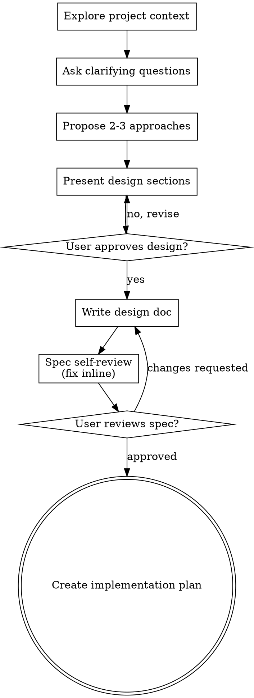

<!-- vendored from obra/superpowers v6.1.1 @ 5a0f8953, MIT (c) 2025 Jesse Vincent -->
<!-- Next maintainer: check drift with
     git clone --filter=blob:none https://github.com/obra/superpowers.git && \
     git -C superpowers log 5a0f8953..HEAD -- skills/brainstorming/SKILL.md
     Known-unapplied at vendoring time: 05d90ac (2026-07-05, folds Key Principles into points of use). -->

# Brainstorming Ideas Into Designs

Help turn ideas into fully formed designs and specs through natural collaborative dialogue.

Start by understanding the current project context, then ask questions one at a time to refine the idea. Once you understand what you're building, present the design and get user approval.

<HARD-GATE>
Do NOT invoke any implementation skill, write any code, scaffold any project, or take any implementation action until you have presented a design and the user has approved it. This applies to EVERY qualifying project (see below) regardless of perceived simplicity.
</HARD-GATE>

## When this is REQUIRED in TBD

Decisions must be examinable — changes to our theory of the system or the product most of all. Code
expresses a theory; a diff shows what changed, not why the theory did.

So run this before implementing anything that is not a bug fix or a minor UI change. A bug fix
restores the system to its existing theory; the work that needs a spec is the work that revises it.
Work that always qualifies:

- a new subsystem — a new directory under `Sources/`, or a new actor/service that owns state
- adding or changing a feature flag or `config` column
- a database migration
- wholesale-replacing a load-bearing path (rendering, input routing, persistence)
- a new heuristic, format, or protocol — anything encoding a claim about how something behaves

**Prior design does not exempt.** If the thinking already happened — in prototypes, a report,
another repo, or an earlier session — the spec is a transcription, not new work, and it is *more*
necessary rather than less: none of that material is in this repo, so no reviewer can read it.

**A human answers these questions. You may not answer your own.** A spec you both asked and
answered contains no human judgement while looking like diligence. If no human is available to
answer, stop and say so — do not proceed on assumed answers.

**You may not originate feature work.** If you notice TBD needs a capability it lacks, file it for
a human rather than starting it.

While designing, surface these existing TBD rules where they apply (all in `CLAUDE.md`):
- Large or risky new behavior ships behind a default-off flag.
- Database migrations must update the shared model (migration + GRDB record + Codable model, one commit).
- New delays and timers take an injected clock.

When deciding whether new behavior is compiled or user-land, run the placement battery in
[`docs/theory-placement.md`](../../../docs/theory-placement.md).

## Anti-Pattern: "This Is Too Simple To Need A Design"

Once work qualifies above, it goes through this process — however small the diff looks. Qualifying work is exactly where unexamined assumptions cause the most wasted work: a one-line default flip is a migration, a "tiny" flag is a config column. The design can be short (a few sentences), but you MUST present it and get approval.

## Checklist

You MUST create a task for each of these items and complete them in order:

1. **Explore project context** — check files, docs, recent commits
2. **Ask clarifying questions** — one at a time, understand purpose/constraints/success criteria
3. **Propose 2-3 approaches** — with trade-offs and your recommendation
4. **Present design** — in sections scaled to their complexity, get user approval after each section
5. **Write design doc** — save to `docs/specs/YYYY-MM-DD-<topic>-design.md` and commit
6. **Spec self-review** — quick inline check for placeholders, contradictions, ambiguity, scope (see below)
7. **User reviews written spec** — ask user to review the spec file before proceeding
8. **Transition to implementation** — create an implementation plan (see Implementation below)

## Process Flow

**The terminal state is an approved, committed spec plus an implementation plan.** Do NOT invoke frontend-design, mcp-builder, or any other implementation skill.

## The Process

**Understanding the idea:**

- Check out the current project state first (files, docs, recent commits)
- Before asking detailed questions, assess scope: if the request describes multiple independent subsystems (e.g., "build a platform with chat, file storage, billing, and analytics"), flag this immediately. Don't spend questions refining details of a project that needs to be decomposed first.
- If the project is too large for a single spec, help the user decompose into sub-projects: what are the independent pieces, how do they relate, what order should they be built? Then brainstorm the first sub-project through the normal design flow. Each sub-project gets its own spec → plan → implementation cycle.
- For appropriately-scoped projects, ask questions one at a time to refine the idea
- Prefer multiple choice questions when possible, but open-ended is fine too
- Only one question per message - if a topic needs more exploration, break it into multiple questions
- Focus on understanding: purpose, constraints, success criteria

**Exploring approaches:**

- Propose 2-3 different approaches with trade-offs
- Present options conversationally with your recommendation and reasoning
- Lead with your recommended option and explain why

**Presenting the design:**

- Once you believe you understand what you're building, present the design
- Scale each section to its complexity: a few sentences if straightforward, up to 200-300 words if nuanced
- Ask after each section whether it looks right so far
- Cover: architecture, components, data flow, error handling, testing
- Be ready to go back and clarify if something doesn't make sense

**Design for isolation and clarity:**

- Break the system into smaller units that each have one clear purpose, communicate through well-defined interfaces, and can be understood and tested independently
- For each unit, you should be able to answer: what does it do, how do you use it, and what does it depend on?
- Can someone understand what a unit does without reading its internals? Can you change the internals without breaking consumers? If not, the boundaries need work.
- Smaller, well-bounded units are also easier for you to work with - you reason better about code you can hold in context at once, and your edits are more reliable when files are focused. When a file grows large, that's often a signal that it's doing too much.

**Working in existing codebases:**

- Explore the current structure before proposing changes. Follow existing patterns.
- Where existing code has problems that affect the work (e.g., a file that's grown too large, unclear boundaries, tangled responsibilities), include targeted improvements as part of the design - the way a good developer improves code they're working in.
- Don't propose unrelated refactoring. Stay focused on what serves the current goal.

## After the Design

**Documentation:**

- Write the validated design (spec) to `docs/specs/YYYY-MM-DD-<topic>-design.md`
  - (User preferences for spec location override this default)
- Use the `writing-clearly-and-concisely` skill (vendored in this repo) to tighten the prose
- Commit the design document to git

**Spec Self-Review:**
After writing the spec document, look at it with fresh eyes:

1. **Placeholder scan:** Any "TBD", "TODO", incomplete sections, or vague requirements? Fix them.
2. **Internal consistency:** Do any sections contradict each other? Does the architecture match the feature descriptions?
3. **Scope check:** Is this focused enough for a single implementation plan, or does it need decomposition?
4. **Ambiguity check:** Could any requirement be interpreted two different ways? If so, pick one and make it explicit.

Fix any issues inline. No need to re-review — just fix and move on.

**User Review Gate:**
After the spec review loop passes, ask the user to review the written spec before proceeding:

> "Spec written and committed to `<path>`. Please review it and let me know if you want to make any changes before we start writing out the implementation plan."

Wait for the user's response. If they request changes, make them and re-run the spec review loop. Only proceed once the user approves.

**Implementation:**

- If `superpowers:writing-plans` is available, invoke it to create the implementation plan.
- If it is not, write the plan yourself to `docs/plans/YYYY-MM-DD-<feature>.md` covering: exact
  files to create/modify, one testable deliverable per task, and a test-first step order.
- Either way the plan is scratch: `docs/plans/`, `docs/implementation-plans/`, and
  `docs/superpowers/plans/` are gitignored. Never `git add` a plan. See `docs/CLAUDE.md`.
- Do NOT invoke any other skill.

## Key Principles

- **One question at a time** - Don't overwhelm with multiple questions
- **Multiple choice preferred** - Easier to answer than open-ended when possible
- **YAGNI ruthlessly** - Remove unnecessary features from all designs
- **Explore alternatives** - Always propose 2-3 approaches before settling
- **Incremental validation** - Present design, get approval before moving on
- **Be flexible** - Go back and clarify when something doesn't make sense
