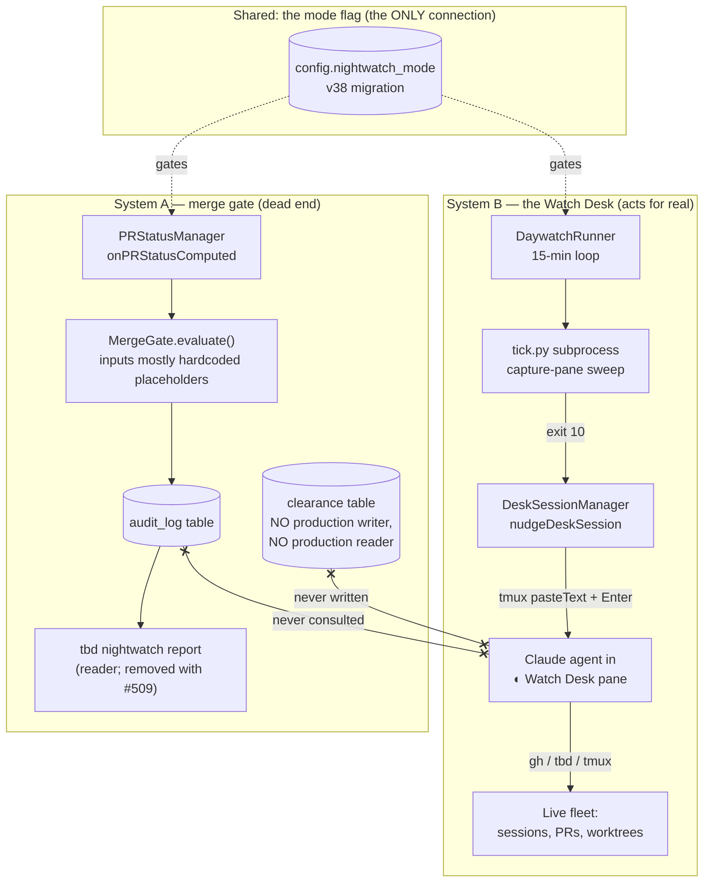
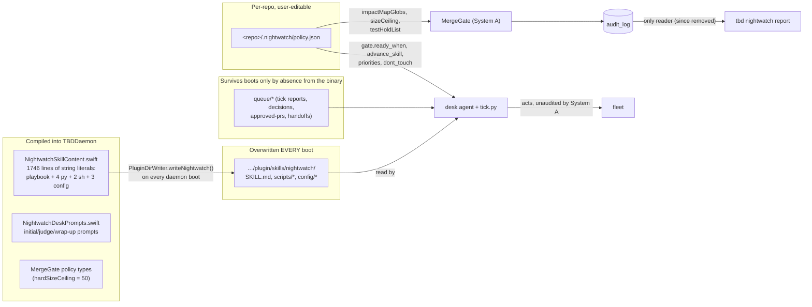
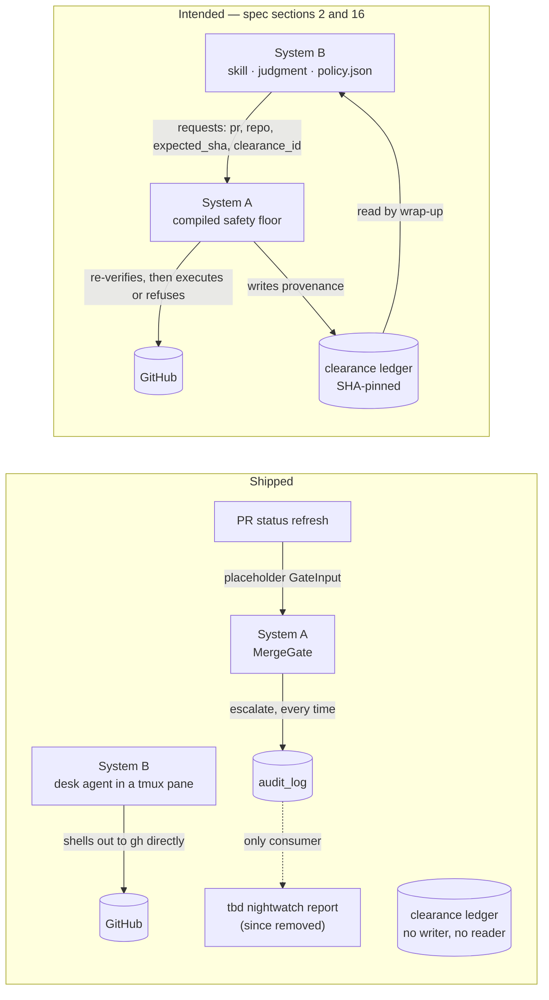

# Nightwatch

Status of this document: an **as-built audit record** of the existing Nightwatch implementation — the baseline for the system its replacement design supersedes. Written against the tree as of 2026-07-25; **citations and content claims re-verified against the tree in the dated refresh passes below, most recently 2026-08-03.** Every claim below is cited to `file:line` in this worktree. If the code and this doc disagree, the code wins — then fix the doc. As an audit record, this document carries the dated verification banners the house stands-alone rule exempts for exactly this purpose (root `CLAUDE.md`): the dates record what was measured against which tree, which is the evidence an audit exists to keep.

> **Citation refresh, 2026-07-27; scope corrected and general-tree citations re-derived 2026-07-28.** What was verified *exactly* on 2026-07-27 was the embedded-content files — `NightwatchSkillContent.swift` and `NightwatchDeskPrompts.swift` — whose line counts and member boundaries were re-derived member by member and remain exact. Citations into **general TBD files** (`Daemon.swift`, `Models.swift`, `Database.swift`, `ConfigStore.swift`, `AppState.swift`, `DaemonClient.swift`, `SidebarView.swift`, `RPCRouter*`) were *not* covered by that pass and had drifted by tens to hundreds of lines; they were re-derived against the tree on 2026-07-28. Three app files cited here were deleted by PRs #507/#517 on 2026-07-26 and are marked at each citation; the `tbd nightwatch report` subcommand and the `nightwatch.report` RPC no longer exist and the claims about them are corrected in place. `NightwatchSkillContent.swift` grew from 981 to 1528 lines after this document was first written (a `handoffPy` member, a "there is no babysitter daemon" correction in `skillMd`, and other edits), which invalidated every line citation into it by roughly 450–550 lines. All of them have been re-derived, along with the `NightwatchDeskPrompts.swift` citations (that file grew 144 → 200 lines). Three content claims went stale with the same growth and are corrected inline where they appear, each marked: `scripts/handoff.py` is no longer an unowned survivor (§5.2, §6.7, §9), the Settings help text no longer claims the feature is evaluate-only (§6.4), and the hibernation pending-input precedent was mis-described as flag-gated (§4.5, §8 item 4). Citations into System A files deleted by PR #509 (`MergeGate.swift`, `Models_Nightwatch.swift`) are deliberately left as-is — the banner below marks that whole half as a historical record.

> **Citation refresh, 2026-08-02.** PR #562 (merged 2026-07-31) rewrote the nudge mechanism and grew `DeskSessionManager.swift` from 371 to 614 lines, `NightwatchSkillContent.swift` from 1528 to 1610, and `NightwatchDeskPrompts.swift` from 200 to 324; every line citation into those three files has been re-derived. General-tree citations (`Daemon.swift`, `Models.swift`, `RPCProtocol.swift`, `ConfigStore.swift`, `RPCRouter.swift`, `PluginDirWriter.swift`, `AppState.swift`, `DaemonClient.swift`, `SettingsView.swift`, and the test files) were re-checked in the same pass and corrected where they had drifted; `DaywatchRunner.swift` citations were re-verified unchanged. Five behavioral claims went stale with the same growth and are corrected inline where they appear: the nudge now writes the judge instructions to a file in the desk worktree and pastes only a one-line pointer, with the inline prompt as a fallback, and respawns a missing desk terminal before nudging (§3.2, §6.1); the wrap-up resolves a live desk terminal and skips when none exists (§3.4, §6.1); the context-ceiling handoff threshold is ~600k tokens, not ~200k (§6.2); nightwatch shifts now carry an explicit unattended-merge authorization for one author's loop-perfect PRs (§4.2, §6.2); and the embedded skill content no longer asserts that no babysitter daemon ever existed — it now documents a machine-local, out-of-band one (§6.2).

> **Citation refresh, 2026-08-03.** The Watch Desk exclusive-judge-lease subsystem ([`docs/specs/2026-08-01-nightwatch-exclusive-judge-lease-design.md`](specs/2026-08-01-nightwatch-exclusive-judge-lease-design.md)) merged from `main` and grew `NightwatchSkillContent.swift` from 1610 to 1746 lines, `DeskSessionManager.swift` from 614 to 761, `NightwatchDeskPrompts.swift` from 324 to 328, `RPCRouter+NightwatchHandlers.swift` from 16 to 122, and `NightwatchCommand.swift` from 64 to 183; every line citation into those files, and the general-tree citations that drifted with the same merge (`Models.swift`, `RPCProtocol.swift`, `Database.swift`, `RPCRouter.swift`, `AppState.swift`, `DaemonClient.swift`), has been re-derived. Where the lease now occupies files this document describes — the desk protocol's lease operations, the lease RPC handlers and CLI subcommands, and the lease-based judge-terminal resolution in the nudge/wrap-up paths — the affected sentences are corrected in place (§3.4, §6.1, §6.3, §6.5); this document does not otherwise describe the new subsystem, which has its own spec.

Nightwatch is TBD's autonomous "fleet babysitter" feature: while the user is away (or merely distracted), something should keep the ~40 agent worktrees unblocked, triage stuck sessions, and shepherd PRs toward merge. This document explains what actually shipped under that name — which is substantially less, and structurally different, than either the feature's design spec or its own Settings copy suggests.

> ### ⚠︎ Update 2026-07-26: System A has been removed (PR #509)
>
> **System A — the entire compiled merge-gate half — was deleted from `main` by [PR #509](https://github.com/cheapsteak/tbd/pull/509), merged 2026-07-26.** That is: `MergeGate.swift`, the `clearance` table and `ClearanceStore`, the `audit_log` write path fed by the PR-status hook, `AuditAction`, and the `Daemon.swift` wiring that fed it placeholder inputs. System B (the Watch Desk) remains in the tree. Everything below describing System A is preserved as a historical record of what was removed and why; the rest of this document describes the tree as of 2026-07-25, before that removal.
>
> The rationale that motivated the removal:
>
> 1. **The invariant it protects is already enforced better by the forge.** Branch protection's *"dismiss stale pull request approvals when new commits are pushed"* is exactly approval-bound-to-content, and GitHub's auto-merge plus merge queue supply the act-time re-verification. Crucially, forge enforcement sits **outside the trust boundary of the machine running the agents** — an agent with a shell can invoke `gh pr merge`, but it cannot merge what branch protection refuses. No local daemon-side gate can make that claim.
> 2. **Of the three motivating incidents, only one is a merge problem.** Contested PR ownership is a concurrency problem; premature archival is a worktree-state problem. Neither needs a merge gate.
> 3. **The extension mechanism it should have used already exists.** `HookResolver` ships the exact user-local → checked-in → global precedence this feature wanted; it is missing only fleet-state *events*, not machinery.
>
> **The retained problem is fleet supervision — unblocking, triage, archival safety, observability — not merge authorization.** The replacement design lives in [`docs/specs/2026-07-26-fleet-supervision-design.md`](specs/2026-07-26-fleet-supervision-design.md).

---

## 1. The most important fact: "Nightwatch" is two disconnected systems

There are **two independent systems** in this codebase that both answer to the name Nightwatch. They share the `nightwatch_mode` config column and a Swift module prefix, and **nothing else**. Neither invokes, reads, or constrains the other.

**System A — the Swift merge gate ("Phase 1", evaluate-only).**
`MergeGate.swift`, the `clearance` and `audit_log` tables (migrations `v41_clearance_ledger` / `v42_audit_log`, `Database.swift:713-743`), and the shared models in `Models_Nightwatch.swift`. It is wired into `PRStatusManager` at `Daemon.swift:402-454`: every time a PR status is computed while mode ≠ off, the gate evaluates the PR and appends a row to `audit_log`. That is the entire extent of its effect. **It merges nothing, holds nothing, and blocks nothing.** Its only reader was the `tbd nightwatch report` CLI — *removed since: `NightwatchCommand.swift` is now 183 lines carrying `set`, `status`, and the Watch Desk `lease` subcommand group — no `report` — and the `nightwatch.report` RPC is gone with the audit store (#509). The audit log now has no reader at all.* The `clearance` table has a fully built store (`ClearanceStore.swift`) and **zero production writers or readers** — the only references to `db.clearance` outside its own definition are in `Tests/TBDDaemonTests/ClearanceStoreTests.swift`.

**System B — the Watch Desk ("Phase A", the thing that actually acts).**
`DaywatchRunner` (a 15-minute daemon loop, `DaywatchRunner.swift:95-302`) runs `scripts/tick.py` as a subprocess; when the tick exits 10 ("judgment queued"), `DeskSessionManager.nudgeDeskSession` writes the judge instructions to a file in the desk worktree and pastes a one-line pointer into a real Claude Code session running in a tmux pane inside a scratch worktree named "◐ Watch Desk". That agent then acts on the live fleet with `gh`, `tbd terminal send`, `tbd worktree archive`, and tmux — governed by nothing but the prompt text it was handed.

**The Swift merge gate does not gate the thing that merges.** System A evaluates PRs and writes rows nobody acts on. System B acts on the fleet and never consults System A: the desk agent's queue (`queue/decisions.jsonl`) is written by `tick.py` from pane classification, not by `MergeGate`; the gate's audit rows and the (empty) clearance ledger play no part in what the desk does. The design spec's central promise — "the daemon executes the mechanism policy asks for and enforces the safety floor as a compiled invariant" (`docs/specs/2026-07-03-nightwatch-daywatch-design.md` §2) — is not true of the shipped system. The compiled floor exists but is disconnected; the actuator exists but is uncompiled prompt text.



---

## 2. Layered topology

From the outside in:

- **UI / CLI** — `NightwatchModeToggle` (sidebar footer), `NightwatchStatusItem` (menu bar), `NightwatchDeskStatusBanner` *(deleted by #507/#517; described as of its last state)*, Settings toggle; `tbd nightwatch set/status` (`report` has since been removed)
  - *Does:* Set/display the mode; read the audit log. App surfaces are gated on the `nightwatchExperimentalEnabled` UserDefaults key (default false).
- **RPC** — `nightwatch.setMode` (`RPCProtocol.swift:216`); `nightwatch.report` has since been removed with the audit store; six `nightwatch.lease.*` methods now sit alongside (`RPCProtocol.swift:217-222`); `nightwatchMode` rides the `Config` payload (`RPCProtocol.swift:669`)
  - *Does:* Persist the mode, apply it to the runner, broadcast a config-changed delta; serve audit rows.
- **Daemon control plane** — `DaywatchRunner` (loop + mode transitions), `DeskSessionManager` (desk lifecycle + tmux injection), `ProcessDaywatchExecutor` (tick subprocess), the `MergeGate` hook on `PRStatusManager`
  - *Does:* Owns *when* things happen. Owns almost nothing about *what* happens.
- **Policy / desk agent** — `NightwatchSkillContent.swift` (1746 lines of Swift string literals: SKILL.md, four Python scripts, two shell scripts, three config files), `NightwatchDeskPrompts.swift`, written to disk by `PluginDirWriter.writeNightwatch()`
  - *Does:* Owns *what* happens: classification rules, safety rules, escalation etiquette, the merge policy the desk actually follows. All of it is prompt/script text.
- **Fleet** — Every other TBD-managed session, reached via `sqlite3 ~/tbd/state.db`, `tmux capture-pane`, `gh`, and the `tbd` CLI
  - *Does:* The thing being babysat.

Note what is *not* a layer: there is no daemon-side enforcement between the desk agent and the fleet. Once nudged, the desk is an ordinary Claude session with whatever permissions its profile grants.

---

## 3. Pragmatics: what actually happens at runtime

### 3.1 Boot

1. `Daemon.start()` calls `RuntimeIntegrationRefresher.production().refresh()` (`Daemon.swift:286`), which calls `PluginDirWriter().writePlugin()` (`Daemon.swift:17`, invoked at `:32`), which calls `writeNightwatch()` (`PluginDirWriter.swift:80`, body at `:87-108`). This **unconditionally overwrites** `SKILL.md`, the three config files, and every script in `NightwatchSkillContent.scripts` — `tick.py`, `wake.py`, `judge.py`, `handoff.py`, `tick-cron.sh`, `scheduler.sh` — under `~/Library/Application Support/TBD/plugin/skills/nightwatch/` on **every daemon boot**. There is no existence check, no merge, no hash comparison. The writer iterates the `scripts` array (`NightwatchSkillContent.swift:21-28`) rather than carrying its own list, so a script named in a desk prompt but absent from the array is a drift `NightwatchDeskPromptsTests` now catches.
2. Later in `start()`, the runner is constructed with `skillDir = PluginDirWriter.pluginDirPath + "/skills/nightwatch"` (`Daemon.swift:744`) and boot-reconciled: `await runner.apply(mode: config.nightwatchMode)` (`Daemon.swift:766`). If the persisted mode is `daywatch` or `nightwatch`, the loop starts immediately.

### 3.2 Mode toggle → desk spawn → tick loop → nudge

```mermaid
sequenceDiagram
    participant UI as App/CLI
    participant R as RPCRouter
    participant DR as DaywatchRunner (actor)
    participant DM as DeskSessionManager (actor)
    participant T as tick.py (subprocess)
    participant P as tmux pane (desk Claude)

    UI->>R: nightwatch.setMode {daywatch}
    R->>R: db.config.setNightwatchMode
    R->>DR: apply(mode: .daywatch)
    Note over DR: gateAcquire() — FIFO gate<br/>serializes the whole transition
    DR->>DM: ensureDeskSession(mode:)
    DM->>DM: find/create "◐ Watch Desk" scratch worktree
    DM->>P: lifecycle.spawnPrimaryTerminals(initialPrompt:)
    Note over P: Claude boots with<br/>NightwatchDeskPrompts.initialPrompt
    DR->>DR: loopTask = Task { runLoop() }
    R-->>UI: broadcast .modelProfilesChanged (config reload)

    loop every 15 min (DaywatchRunner.defaultInterval)
        DR->>T: executor.runTick() — /usr/bin/python3 tick.py
        Note over T: sweeps every tmux server via capture-pane,<br/>classifies panes, writes queue/tick-report.json,<br/>appends queue/decisions.jsonl
        T-->>DR: exit 0 (silent) or 10 (judgment queued)
        alt exit == 10
            DR->>DM: nudgeDeskSession(worktreeID, act:)
            Note over DM: skip if last nudge < 10 min ago;<br/>respawn desk terminal if none is live
            DM->>DM: write JUDGE-INSTRUCTIONS.md<br/>into the desk worktree
            DM->>P: tmux.pasteText(one-line judgeNudge pointer)<br/>(full judgePrompt inline only if the write failed)
            DM->>P: tmux.sendKey("Enter")  ⚠ no pending-input check
            Note over P: agent reads JUDGE-INSTRUCTIONS.md (once per session),<br/>then decisions.jsonl,<br/>acts via gh / tbd / tmux
        end
    end
```

Details worth knowing:

- The tick subprocess runs with stdout/stderr discarded (`FileHandle.nullDevice`, `DaywatchRunner.swift:32-33`) and a 5-minute kill deadline (`DaywatchRunner.swift:64-77`). The human-readable summary `tick.py` prints is thrown away on this path; only the exit code survives.
- `tick.py` takes a machine-global `flock` on `/tmp/nightwatch-tick.lock` (`NightwatchSkillContent.swift:953-964` in the embedded source) so the in-daemon loop and an optionally-enabled launchd scheduler can't run concurrent ticks; the loser exits 0 silently.
- A nudge does not paste the full judge instructions. `nudgeDeskSession` re-resolves a live desk agent terminal (now via the judge lease) — respawning one when the row's pane has died, so a failed launch doesn't become a silent all-night outage (`DeskSessionManager.swift:511-528`) — rewrites `JUDGE-INSTRUCTIONS.md` in the desk worktree (`writeJudgeInstructions`, `DeskSessionManager.swift:674-709`), and pastes only a one-line `judgeNudge` pointer carrying the mode/act flag and a read/re-read hint (`DeskSessionManager.swift:548-565`, `NightwatchDeskPrompts.swift:150-164`). The full `judgePrompt` is pasted inline only when the file write fails. `lastNudgedMode` (`DeskSessionManager.swift:92`) is how the daemon tells a reused desk that a mode flip changed the instructions out from under it.
- `act = (effectiveMode == .nightwatch)` (`DaywatchRunner.swift:259`) is the entire daywatch/nightwatch difference at the mechanism level — see §5.3.
- `runOnce()` re-attempts `ensureDeskSession` on each tick if desk creation failed at mode-start (`DaywatchRunner.swift:226-245`).
- A daywatch↔nightwatch switch while running does not restart anything; it re-runs `ensureDeskSession`, which fast-paths to the existing desk (`DaywatchRunner.swift:199-210`, `DeskSessionManager.swift:133-150`). The new mode takes effect through the next nudge, which rewrites `JUDGE-INSTRUCTIONS.md` and flags the change so the judge re-reads it (`DeskSessionManager.swift:548-565`).

### 3.3 Mode state machine, including the restart wrinkle

```mermaid
stateDiagram-v2
    [*] --> off
    off --> daywatch: apply(.daywatch)<br/>ensureDeskSession + start loop
    off --> nightwatch: apply(.nightwatch)<br/>ensureDeskSession + start loop
    daywatch --> nightwatch: re-ensure desk (reused);<br/>next nudge carries act=true
    nightwatch --> daywatch: re-ensure desk (reused);<br/>next nudge carries act=false
    daywatch --> off: cancel loop +<br/>postShiftWrapUp (paste + Enter)
    nightwatch --> off: cancel loop +<br/>postShiftWrapUp<br/>(⚠ prompt says "Daywatch Ending")

    note right of off
        Desk worktree is NOT archived on off —
        left active for review.
        closeDeskSession() exists but has
        no production caller.
    end note

    note left of nightwatch
        DAEMON RESTART while mode is on:
        stop() → apply(.off) → wrap-up pasted
        boot  → apply(persisted mode) → desk re-ensured,
        first tick fires immediately.
        The agent gets "your shift is ending"
        followed seconds later by a fresh shift.
        DeskSessionManager is rebuilt, so
        lastNudgeTime resets to nil — the
        10-minute overlap guard is defeated.
    end note
```



The restart path is real, not hypothetical: `Daemon.stop()` calls `runner.apply(mode: .off)` (`Daemon.swift:894-897`), which posts the wrap-up (`DaywatchRunner.swift:187-198` → `DeskSessionManager.postShiftWrapUp`, `:433-476`); boot then calls `apply(mode: config.nightwatchMode)` (`Daemon.swift:766`). The persisted mode is untouched by shutdown — only the runner's in-memory mode goes to `.off` — so every `scripts/restart.sh` while a watch is active produces the wrap-up/re-nudge whiplash and resets the overlap guard (`lastNudgeTime` is actor state initialized to nil, `DeskSessionManager.swift:78`, never persisted).

### 3.4 Turning it off

`apply(.off)` cancels the loop and calls `postShiftWrapUp`, which resolves a live desk agent terminal through the judge lease (skipping the wrap-up entirely when none is alive or ownership is contested), pastes `NightwatchDeskPrompts.wrapUpPrompt` into its pane, presses Enter, and fires a `.taskComplete` notification reading "Daywatch ended — shift summary posted to the Watch Desk." (`DeskSessionManager.swift:433-476`). Two defects here:

- **The wrap-up is mode-blind.** `wrapUpPrompt` is a `static let` hardcoding "# ◐ Daywatch Ending — Shift Summary" (`NightwatchDeskPrompts.swift:94-108`, literal at `:95`), and the notification string is likewise hardcoded (`DeskSessionManager.swift:469`) — both fire even when the mode being exited is `nightwatch`. Its siblings (`initialPrompt`, `judgePrompt`, `judgeNudge`) take a `mode:` parameter; this one does not.
- **The desk is never cleaned up.** `closeDeskSession()` (`DeskSessionManager.swift:600-634`) — kill windows, delete terminal rows, archive the worktree — is complete, tested (`DeskSessionManagerTests.swift:201-237`), and **called from nowhere in production code**. The off-transition deliberately "leaves desk active for user review" (`DaywatchRunner.swift:188`), which means the archive path is unreachable and the Watch Desk worktree accumulates as a permanent scratch space.

### 3.5 What System A does meanwhile

While mode ≠ off, every PR status computation runs the gate hook (`Daemon.swift:402-454`):

1. Load `.nightwatch/policy.json` from the repo (or `NightwatchPolicy.conservativeDefaults`, `MergeGate.swift:133-157`).
2. Build a `GateInput` that is mostly fiction — the hook's own comment says so (`Daemon.swift:410-414`): `headSHA: "unknown"`, `hasApprovedReview: false`, `checksClean` approximated from the cached PR state, `files: nil`, `commits: nil`, `authorWorktreeID: nil` (`Daemon.swift:415-427`).
3. Evaluate and append one `audit_log` row (`Daemon.swift:445-453`).

Because `hasApprovedReview` is hardcoded `false` and the safety floor escalates on exactly that condition (`MergeGate.swift:234-236`), **in production the gate can only ever return `.escalate("Missing claude-review APPROVED on current head SHA")`**. The `.wouldMerge` and `.hold` branches — the impact map, the test-coverage heuristic, the size ceiling, the glob engine — are reachable only from `MergeGateTests.swift`. The production audit log is a stream of identical escalate rows, one per PR per status refresh, with no deduplication and no retention policy (`AuditStore` has insert/list/get/count and no delete, `AuditStore.swift:45-115`).

---

## 4. Semantics: what the pieces mean and what they actually guarantee

### 4.1 `NightwatchMode`

`off | daywatch | nightwatch` (`Models.swift:106-110`). Persisted in `config.nightwatch_mode` (migration `v38`, `Database.swift:691-695`; setter `ConfigStore.swift:233-240`; decode-with-default at `Models.swift:976-977` and `RPCProtocol.swift:714-715`). Semantically: *off* = no loop, no gate hook; *daywatch* = loop + gate hook, desk nudged with `act=false`; *nightwatch* = same with `act=true`.

### 4.2 Daywatch vs. Nightwatch is prompt text, nothing more

The runner computes `act = (mode == .nightwatch)` (`DaywatchRunner.swift:259`); `nudgeDeskSession` maps that back to a mode and regenerates the `judgePrompt` body it writes to `JUDGE-INSTRUCTIONS.md` — an action hint of "triage only; act on small_safe/preclear; batch rest for human review" vs. "act on what the gate allows — including merging loop-perfect `<human-login>` PRs" (`NightwatchDeskPrompts.swift:172-178`), plus a shared merge rule whose authorization half differs by mode: a nightwatch shift MAY run an unattended `gh pr merge` on a loop-perfect PR by that one author, while a daywatch shift must report it and stop (`mergeRule`, `NightwatchDeskPrompts.swift:266-293`). Same loop, same 15-minute interval (`DaywatchRunner.defaultInterval`, `:100`), same desk session, same profile-resolved model (`DeskSessionManager.swift:717-759` — mode does not influence model selection). **There is no mechanism-level difference between the modes.** The "conservative" daywatch posture exists exactly as long as the desk agent chooses to comply with a sentence in its prompt.

A related vocabulary bug: `judgePrompt` instructs the agent to "act ONLY if clearanceKind in [preclear, small_safe]" (`NightwatchDeskPrompts.swift:191`), but the judgment-queue items `tick.py` writes have `kind: decision | maybe-archive` and **no `clearanceKind` field at all** (embedded `tick.py`, `NightwatchSkillContent.swift:1007-1009`). `ClearanceKind` is System A vocabulary (`Models_Nightwatch.swift:5-9`) leaked into System B's prompt against a queue format that never carries it. The daywatch "safety rule" is therefore not merely advisory — it is unsatisfiable as written.

### 4.3 The desk's identity is a display name

`ensureDeskSession` recovers an existing desk by scanning active worktrees for `displayName == "◐ Watch Desk" && isScratch` (`DeskSessionManager.swift:158-159`, constant at `NightwatchDeskPrompts.swift:8`). The app's status banner resolved the desk the same way (`NightwatchDeskStatusBanner.swift:35`, *deleted by #507/#517; described as of its last state*). Rename the worktree and both the daemon's recovery path and the app's click-through silently stop finding it. The cached UUID is validated on the fast path (`DeskSessionManager.swift:133-150` — the check now also requires a live configured-agent terminal, not just an active row), but any restart falls back to name matching.

### 4.4 The hand-rolled FIFO gates (a genuinely good part)

Both actors carry an identical `gateAcquire`/`gateRelease` pair (`DaywatchRunner.swift:121-139`, `DeskSessionManager.swift:51-69`). Swift actors are **reentrant across suspension points**: while `apply()` awaits `ensureDeskSession`, a second `apply()` call can enter the actor and interleave with the first's read→await→write window on `currentMode`/`deskWorktreeID`. Real interleavings this caused or could cause are documented in the comments: double-click on the mode toggle double-creating a desk, boot-reconcile racing a user toggle, an off-during-ensure archiving the desk a newer ensure just made (`DaywatchRunner.swift:116-120`, `DeskSessionManager.swift:44-50`). The gate makes each public mutating operation atomic: `gateBusy` plus a FIFO array of continuations; a waiter resumed by `gateRelease` inherits the busy flag (`gateBusy` intentionally stays true, `:127` / `:57`). `nudgeDeskSession` also runs under the gate because its 10-minute overlap check is a non-atomic check-then-act (`DeskSessionManager.swift:486-498`). This is a correct, minimal mutex-for-actors; if you touch these actors, keep every await-crossing mutation inside the gate.

### 4.5 What tmux injection guarantees (nothing)

`nudgeDeskSession` and `postShiftWrapUp` do `tmux.pasteText(...)` then unconditionally `tmux.sendKey(key: "Enter")` (`DeskSessionManager.swift:567-579` and `:452-463`). There is no check of what is currently in the pane's composer. On 2026-07-25 this spliced a nudge into the middle of a word a human was typing in the desk pane and submitted the mangled line.

Precedent for the fix already exists in-tree, and it is worth stating precisely because the hibernation path carries *two* pending-input rails and only one of them is flag-gated:

- `HibernationSafetyChecks.hasPendingInput(paneCapture:)` — the sanctioned TUI scrape — runs **unconditionally** as the always-on backup rail on the park path (`HibernationCoordinator.swift:313`, its only production call site). No feature flag guards it; the pane capture it reads is taken for the parked-view snapshot anyway, so the check is free.
- `hibernate_input_veto_enabled` (v51) gates a *different*, event-based veto: `HibernationGate.decide` blocks a park when `lastInputAt >= idleSince` (`HibernationGate.swift:64`). That flag made the input-pipeline veto primary and demoted the scrape to a backup rail — it never made the scrape conditional.

Either way the point for the nudge path stands and is in fact stronger: a shipped, always-on pending-input check exists one directory away, and the nudge path predates it and never adopted it.

### 4.6 The experimental flag gates pixels, not behavior

`nightwatchExperimentalEnabled` (UserDefaults, default false; key at `AppState.swift:2706`, fail-closed reader at `:2712-2714`) hides the sidebar segmented control (`SidebarView.swift:97-98`) and the menu-bar menu (`NightwatchStatusItem.swift:16, 27`). It also hid the desk banner and the window tint, whose files (`NightwatchDeskStatusBanner.swift`, `NightwatchModeTintModifier.swift`, `NightwatchModeTheme.swift`) were *deleted by #507/#517* — the mode tint now lives in the status bar. It does **not** gate the daemon: `tbd nightwatch set daywatch` works regardless of the app flag, the loop runs, the desk spawns, audit rows accrue. The flag is an app-side visibility toggle, not a feature flag in the CLAUDE.md sense — the daemon-side behavior has no flag at all beyond the mode itself.

### 4.7 `wakeJudge` is a documented no-op

`ProcessDaywatchExecutor.wakeJudge(act:)` logs and returns (`DaywatchRunner.swift:83-90`); the comment records the intent — the interim headless judge spawner was removed in favor of the visible desk, and the fallback is reached only when no desk manager is wired (`DaywatchRunner.swift:266-269`). In production a desk manager is always wired (`Daemon.swift:748-760`), so this path is effectively test-only scaffolding.

---

## 5. Policy is compiled into the binary

This is the central maintenance problem, and it deserves its own section because it inverts the design's stated architecture.

`Sources/TBDShared/NightwatchSkillContent.swift` is **1746 lines of Swift raw string literals** containing the entire operational playbook: `scripts` (the install manifest, `:21-28`), `skillMd` (`:30-230`), `wakePy` (`:232-625`), `tickPy` (`:627-1073`), `handoffPy` (`:1082-1472`), `judgePy` (`:1474-1647`), `tickCronSh` (`:1649-1664`), `schedulerSh` (`:1666-1719`), `prioritiesTxt` (`:1721-1726`), `safeWedgesTxt` (`:1728-1738`), `dontTouchTxt` (`:1740-1745`). `PluginDirWriter.writeNightwatch()` (`PluginDirWriter.swift:87-108`) writes all of it to `~/Library/Application Support/TBD/plugin/skills/nightwatch/` on every daemon boot, unconditionally, via `RuntimeIntegrationRefresher` (`Daemon.swift:286`).



Consequences, each verified:

**5.1 Organization- and person-specific detail is compiled into a general-purpose tool — and it violates a house rule.**

> **Redaction note.** Three classes of string are redacted in this document and cited to `file:line` instead of quoted, so the literals stay verifiable in the source without this document adding a second copy of them to the tree: the third-party **organization name** (replaced with `acme`, per the house rule below), real individuals' **first names** (the most frequent one replaced with `<operator>`; others cited to `file:line` and never quoted), and real **GitHub logins** (replaced with `<human-login>` / `acme-claude-reviewer[bot]`). The diagnostic point is unaffected — the finding is precisely that the embedded content names a specific organization and specific individuals, and it does; this document simply declines to be the second place those names live.

The embedded content hardcodes:

- `REPO = "acme-ai/monorepo"` in `judge.py` (`NightwatchSkillContent.swift:1497`) — the PR-gating pass queries this one repo, for everyone who ever builds TBD.
- The reviewer-bot login `acme-claude-reviewer[bot]` (`:1614`) and a specific human's GitHub login, `<human-login>` (`:1607`), baked into the `--jq` filters. The same human login also gates the merge rule in both desk prompts (`NightwatchDeskPrompts.swift:266-293`).
- `acme-ai/monorepo` again in SKILL.md — the required-checks count (`:107`) and the commit-signing rule (`:178`).
- Person-specific first names, more than one of them. `<operator>` appears 17 times (tier table `:47`, `queue/for-<operator>.md` throughout `tick.py`/`judge.py`, "`%352` = `<operator>`'s own monitoring session" in `dont_touch.txt`, `:1742`), plus "needs `<operator>`'s attention" in the wrap-up prompt (`NightwatchDeskPrompts.swift:102`) and "set by `<operator>`" attributions on the merge rule (`:257`, `:275`). A second individual's first name is baked into the standing-rules headers and their surrounding prose (`NightwatchDeskPrompts.swift:58`, `NightwatchSkillContent.swift:132`, `:543`, `:793`) — so the count above covers one name, not every person the sources name.
- A project-specific `/closeout` slash command 14 times, and Slack (`:47`).
- Snapshots of one machine's fleet state at authoring time: `priorities.txt` ships a real task's worktree name (`:1724`), `dont_touch.txt` ships a pane ID comment (`:1742`) — reimposed on every boot on every install.

The house rule is explicit: never check the real third-party organization name, or names prefixed with it, into TBD; use `acme`/`acme-prod` placeholders. **This is a standing rule violation in `main`, not a style nit.** Anyone forking or even just reading TBD gets another organization's repo slug, bot identity, and an individual's GitHub handle compiled into `TBDShared`.

**5.2 The boot-time overwrite is a data-loss path.** The shipped prompts *instruct the agent to edit these very files*: SKILL.md tells the desk the config files are its levers, and the field-learnings flow tells it to record standing rules. Any such edit — to `SKILL.md`, `priorities.txt`, `safe_wedges.txt`, `dont_touch.txt`, or any script — is silently clobbered by the next daemon restart (`PluginDirWriter.swift:95-107`: unconditional `write(toFile:atomically:)` for SKILL.md and the config files, then the same for every entry in `NightwatchSkillContent.scripts`).

> **Correction (2026-07-27).** An earlier revision of this section cited `scripts/handoff.py` — a context-ceiling relay the desk agent wrote for itself — as proof that the hazard bites, on the grounds that it was *not* in `NightwatchSkillContent` and survived reboots only because the writer happened not to write a file by that name. That is no longer true: `handoffPy` was subsequently absorbed into the binary (`NightwatchSkillContent.swift:1082-1472`) and added to the `scripts` install manifest (`:21-28`), so it is now overwritten on every boot like everything else. The absorption is the *outcome* the hazard predicts rather than a refutation of it — an agent-authored artifact was hand-carried into the Swift file, which is exactly the change process §5.3 objects to — but the file is no longer a live example of the survives-by-accident case. The remaining live examples are everything under `queue/` (§6.7).

The hazard itself is unchanged: everything the agent learns that lands in a file the writer owns is gone on the next restart, and the set of owned files has only grown.

**5.3 It follows neither house storage pattern.** CLAUDE.md's "Per-repo config: two storage patterns" is explicit: user-authored editable blobs belong in files under `~/tbd/repos/<repoID>/` with a path-plus-copy-button editor; small structured settings belong in DB `config` columns. Nightwatch policy is neither — it is a user-*editable-looking* set of files whose true source of truth is a Swift file, refreshed destructively. (PR #452's `claude_settings_overlay` column was swept back out to a file for exactly this class of mistake.)

**5.4 The embedded scripts are sanctioned TUI scrapers.** `tick.py`'s `classify()` works by regex over `tmux capture-pane` text — `❯`, "esc to interrupt", "bypass permissions", "context used" (`NightwatchSkillContent.swift:713-745`, with the decision/status patterns at `:691` and `:711` and the context-percentage pattern at `:747`). This is exactly what the "No TUI screen-scraping" rule forbids; `NightwatchSkillContent.swift` is one of the named exclusions in `.swiftlint.yml` (`:123-125`, `:158`) with a comment that it "belongs outside TBD once a plugin/extensibility surface exists." Treat that exclusion as a debt marker, not a license.

**5.5 The shipped scheduler points at a path the writer never creates.** `tick-cron.sh` hardcodes `TICK="$HOME/.claude/skills/nightwatch/scripts/tick.py"` (`:1654`), but `PluginDirWriter` installs under `~/Library/Application Support/TBD/plugin/skills/nightwatch/`. On this machine `~/.claude/skills/nightwatch` does not exist. Enabling the opt-in launchd scheduler from the plugin-dir copy (`scheduler.sh enable`) would therefore run a cron job whose tick script path is dangling — it exercises a *third* install tree that TBD never writes. (`tick.py`'s own lock comment acknowledges the two-tree situation, `:953-957`.)

---

## 6. File-by-file walkthrough

### 6.1 Daemon core — `Sources/TBDDaemon/Nightwatch/`

**`DaywatchRunner.swift` (302 lines)**

- `protocol DaywatchExecuting` (`:9-15`) — seam for tests: `runTick() -> Int32`, `wakeJudge(act:)`.
- `struct ProcessDaywatchExecutor` (`:18-91`) — the real executor. `runTick()` (`:27-81`) launches `/usr/bin/python3 <skillDir>/scripts/tick.py`, output discarded, with an `OSAllocatedUnfairLock`-guarded race between `terminationHandler` and a 5-minute timeout task so the continuation resumes exactly once (returns −1 on launch failure, −2 on deadline kill). `wakeJudge(act:)` (`:88-90`) — intentional no-op, see §4.7.
- `actor DaywatchRunner` (`:95-302`) — state: `currentMode`, `deskWorktreeID`, `lastNudgeAttemptTime` (used only to rate-limit ensure-retry *log lines*, despite the name), `loopTask`, plus the FIFO gate (`gateAcquire`/`gateRelease`, `:124-139`; see §4.4).
  - `init(executor:deskSessionManager:interval:clock:)` (`:143-153`) — takes the injected clock per house rule; the desk manager is optional (nil in some tests).
  - `apply(mode:)` (`:161-213`) — the serialized mode transition: start (ensure desk + spawn loop), stop (cancel loop + `postShiftWrapUp` + judge-lease release; desk left active), or in-place mode switch (re-ensure only). Idempotent for same-mode calls.
  - `runOnce(mode:)` (`:222-275`) — one tick: retry desk ensure if it previously failed, run model-free judge-lease maintenance (`:247-252`), run the tick, and on exit 10 nudge the desk with `act = (mode == .nightwatch)`; falls back to `wakeJudge` only when no desk is wired.
  - `runLoop()` (`:279-301`) — immediate first tick, then `clock.sleep(for:)` between ticks, with a post-sleep cancellation re-check.

**`DeskSessionManager.swift` (761 lines)**

- `protocol DeskSessionManaging` (`:9-16`) — the six operations (four original plus the two Watch Desk lease ones, `releaseJudgeLease`/`maintainJudgeLease`), for mocking in runner tests.
- `actor DeskSessionManager` (`:26-761`) — deps: `TBDDatabase`, `WorktreeLifecycle`, `TmuxManager`, optional `StateSubscriptionManager` (broadcasts worktree deltas so the app updates immediately), `skillDir`, plus a `now:` date seam for the overlap guard (`:29-40`). State: FIFO gate, `deskWorktreeID`, `lastNudgeTime`, `lastNudgedMode` (`:92`) — which mode's instructions the judge last actually received — and a lease-contention notification dedupe (`:96`) (all in-memory; lost on restart).
  - `ensureDeskSession(mode:)` (`:125-241`) — fast path validates the cached ID against a *live* configured-agent terminal (`:133-150`); recovery path re-finds by display name and respawns a missing terminal (`:158-180`); create path allocates a unique `watch-desk*` dir under `TBDConstants.scratchDir`, creates the scratch worktree row, spawns the desk terminal, broadcasts `.worktreeCreated`.
  - `liveAgentTerminals(worktreeID:server:kind:)` (`:269-307`; the singular `liveAgentTerminal` is a thin wrapper over it, `:310-317`) — resolves the desk's live agent pane newest-first, requiring the tmux window to still exist (and, where the tmux layer supports it, the pane's current command to be the configured agent), because stale terminal rows outlive their panes and tmux recycles pane IDs (issue #384). The nudge/wrap-up paths now resolve through `leasedJudgeTerminal(worktree:)` (`:332-397`), which wraps this in the Watch Desk judge lease and fails closed when ownership is ambiguous. The agent kind follows `config.primaryAgentPreference` (`:412-414`), so a codex-primary install gets a codex desk.
  - `postShiftWrapUp(worktreeID:)` (`:433-476`) — resolve the leased judge terminal (skip the wrap-up if none is live and uniquely owned), then paste `wrapUpPrompt` + Enter + `.taskComplete` notification ("Daywatch ended…", `:469`). No pending-input check; mode-blind (§3.4).
  - `nudgeDeskSession(worktreeID:act:)` (`:485-592`) — 10-minute overlap guard (`:491-498`); respawns the desk terminal when no live one is found (`:511-528`); rewrites `JUDGE-INSTRUCTIONS.md` and pastes the one-line `judgeNudge` pointer, falling back to the full inline `judgePrompt` when the write fails (`:548-565`); then paste + Enter with no pending-input check (§4.5). `lastNudgeTime`/`lastNudgedMode` are stamped only after a paste that actually went out (`:581-586`) — a nudge that reached no pane must not start the cooldown.
  - `closeDeskSession()` (`:600-634`) — kill windows, delete terminal/tab rows, archive the worktree, broadcast. **No production caller** (§3.4).
  - `writeJudgeInstructions(deskPath:mode:lease:credentialFile:)` (`:674-709`) — writes the mode-specific `judgePrompt` body (plus, when a lease is held, a lease-renewal section) into the desk worktree; returns nil on failure so callers fall back to the inline paste.
  - `spawnDeskTerminal(worktree:mode:)` (`:717-759`) — resets `lastNudgedMode`/`lastNudgeTime` (a fresh session has read nothing, `:737-738`), pre-writes the instructions file, then delegates to `lifecycle.spawnPrimaryTerminals(initialPrompt:)`, the production spawn path; the model comes from the resolved profile, not from the mode.

**`MergeGate.swift` (371 lines)** *(deleted by #509; described as of its last state)* — System A's brain, deliberately pure (no I/O, no DB).

- `enum GateDecision` / `HoldReason` / `EscalateReason` (`:8-45`) — the typed decision space.
- `struct GateInput` (`:50-99`) — everything the gate wants to know about a PR. In production most of it is placeholder (§3.5).
- `struct NightwatchPolicy` (`:102-158`) — `hardSizeCeiling = 50` is a compiled constant; the memberwise init clamps `compiledSizeCeiling` to it, and the custom `Decodable` init (`:170-182`) routes policy files through the same clamp, so `.nightwatch/policy.json` can tighten but never widen the ceiling (design §7.1's policy-poisoning guard — one of the few spec guarantees actually implemented). `load(repoPath:)` (`:142-157`) falls back to `conservativeDefaults` on absent/malformed files.
- `struct MergeGate` (`:198-371`) — `evaluate(input:)` (`:207-223`): safety floor → hard holds → `.wouldMerge` with a synthetic `phase1-would-merge-<sha8>` marker (no clearance lookup; the comment says Phase 1 defers that to an RPC layer that was never built). `checkSafetyFloor` (`:227-252`): draft / no approved review / approval-SHA mismatch / checks not clean. `checkHardHolds` (`:256-284`): test-hold list, self-modifying CI, impact-map glob match, inadequate test coverage. `hasAdequateTestCoverage` (`:286-304`) + `isTestFile` / `isNonExecutableFile` (`:306-326`): runtime files changed without test files ⇒ hold; docs-only PRs pass. `globToRegexPattern` (`:343-370`): character-scanning glob→regex translation (`**/` = zero-or-more segments, `**` = any depth, `*` = one segment) — written that way because a prior replacement-cascade version corrupted its own output.

### 6.2 Shared — `Sources/TBDShared/`

**`Models_Nightwatch.swift` (90 lines)** *(deleted by #509; described as of its last state)* — `ClearanceKind` (`preclear`/`small_safe`/`in_channel`, `:5-9`), `Clearance` (SHA-pinned clearance record, `:15-47`), `AuditAction` (`wouldMerge`/`hold`/`escalate`/`clearanceVoided`, `:51-56`), `AuditLogEntry` (`:61-90`). Note `clearanceVoided` is an action no production code ever emits.

**`NightwatchDeskPrompts.swift` (328 lines)** — `deskDisplayName = "◐ Watch Desk"` (`:8`); `initialPrompt(mode:skillDir:)` (`:13-90`) — the desk's boot briefing (workspace paths, job description, "field learnings", the ~600k-token context-ceiling handoff instruction at `:67-84`); `wrapUpPrompt` (`:94-108`) — static, mode-blind, names the operator (`:102`); `judgeInstructionsFileName` (`:112`) and `judgeNudge(mode:instructionsPath:instructionsChanged:)` (`:150-164`) — the one-line per-tick pointer the daemon actually pastes, carrying the mode/act flag and a read/re-read hint (the ~5 KB body used to be pasted every tick, which burned the judge's own context on its own heartbeat); `judgePrompt(mode:skillDir:)` (`:172-251`) — the full instruction body written to `JUDGE-INSTRUCTIONS.md`, including the unsatisfiable `clearanceKind` rule (`:191`, §4.2) and operational etiquette (approval memory, claim-before-apply, ≤4-question escalation batches, 80%-capacity check, 600k-token handoff rule); `mergeRule(mode:)` (`:266-293`) — the shared merge authorization: only loop-perfect PRs by one named author qualify, and only a nightwatch shift may run the unattended `gh pr merge`; `jobDescription(mode:)` (`:295-327`) — includes an `.off` case that returns an "ERROR:" string rather than being unrepresentable.

**`NightwatchSkillContent.swift` (1746 lines)** — see §5. Member-by-member: `scripts` (`:21-28`) — the install manifest the writer iterates, which is also what `NightwatchDeskPromptsTests` asserts against so a prompt cannot name an uninstalled script; `skillMd` — the playbook (tier policy, wake rules, "the gate", incident-derived operating rules, config file semantics, opt-in scheduler, and a "The babysitter daemon is machine-local — this skill does not ship one" section at `:186-210`, which disclaims shipping any daemon while recording that a machine-local launchd babysitter does run out-of-band on the authoring fleet's box, and that an earlier assertion that none ever existed was wrong); `wakePy` — pre-wake verifier that re-derives live git/gh truth for hibernated terminals and fails closed to a neutral wake (includes an offline `--selftest` exercised by `PluginDirWriterTests`); `tickPy` — the Tier-0 sweep (capture-pane classification, burn-risk detection, capacity backoff, per-repo `.nightwatch/policy.json` hooks, judgment queue, `/tmp/nightwatch-tick.lock`), whose `daemon_health()` is a deliberately-unwired stub returning an `absent: true` shape instead of probing anything (`:790-807` — its docstring records why the live check was retired and why the stub is not an assertion that no daemon exists); `handoffPy` — the context-ceiling successor relay, agent-authored and later absorbed into the binary (§5.2); `judgePy` — dry-run-by-default queue router with the hardcoded third-party repo/logins; `tickCronSh` — cron wrapper with the dangling `~/.claude` path (§5.5); `schedulerSh` — launchd enable/disable/status; `prioritiesTxt` / `safeWedgesTxt` / `dontTouchTxt` — the three config seeds, containing machine-specific snapshot data.

**`RPCProtocol.swift`** — method name `nightwatch.setMode` (`:216`); `NightwatchSetModeParams`; six `nightwatch.lease.*` method names alongside it (`:217-222`, the Watch Desk lease RPC surface); `nightwatchMode` on the config payload with decode-default `.off` (`:669`, `:714-715`). `nightwatch.report` and `NightwatchReportParams` are gone, removed with the audit store (#509).

**`Models.swift`** — `NightwatchMode` (`:106-110`); `Config.nightwatchMode` with default/decode-default `.off` (`:815`, `:916`, `:976-977`).

### 6.3 Daemon wiring

- **`Server/RPCRouter+NightwatchHandlers.swift` (122 lines)** — `handleSetNightwatchMode` (`:18-28`): persist → `runner.apply(mode:)` → broadcast `.modelProfilesChanged` (the config-reload channel is reused; the app picks the mode up from the next config fetch). `handleNightwatchReport` is gone with the audit store (#509); the rest of the file is the six Watch Desk lease handlers (`:30-121`). Dispatch at `RPCRouter.swift:419-431`.
- **`Lifecycle/PluginDirWriter.swift`** — `writePlugin()` (`:48-83`) writes the `tbd` skill and calls `writeNightwatch(pluginDir:)` (`:87-108`), which writes SKILL.md + three config files + every script in `NightwatchSkillContent.scripts` — six of them (scripts get `0o755`). Called on every boot via `RuntimeIntegrationRefresher` (`Daemon.swift:17`, `:32`, invoked at `:286`).
- **`Database/Database.swift`** — `v38_nightwatch_mode` (`:691-695`, `config.nightwatch_mode TEXT DEFAULT 'off'`); `v41_clearance_ledger` (`:713-729`) and `v42_audit_log` (`:730-743`), both of whose tables were dropped by `v60` (#509) while the migrations themselves remain, as migrations must. The `db.clearance` / `db.audit` store handles were *removed by #509* along with `ClearanceStore.swift` and `AuditStore.swift`; only the migration bodies and `v60`'s `DROP TABLE` statements mention those tables today.
- **`Database/ConfigStore.swift`** — `nightwatch_mode` column mapping (`:26`, `:58`) and `setNightwatchMode` (`:233-240`).
- **`Database/AuditStore.swift`** *(deleted by #509; described as of its last state)* — `AuditLogRecord` (`:7-42`), `logAction` (insert + mirrored `os.Logger` debug line, `:54-68`), `list` / `get` / `countByAction` (`:71-114`). No pruning.
- **`Database/ClearanceStore.swift`** *(deleted by #509; described as of its last state)* — `ClearanceRecord` (`:6-44`); `insert` / `voidByID` / `voidBySHA` / `listByPR` / `auditTrail` / `get` (`:55-116`). Fully built, entirely unused outside tests.
- **`PR/PRStatusManager.swift`** — the seam System A hung off was `setOnPRStatusComputed`, *added by #342 for the gate hook and removed by #509 with it* — not renamed. The callbacks the file carries today (`setOnMergedTransition`, `:49`; `setOnStatusPersist`, `:58`) are separate, pre-existing seams that never fed the gate.
- **`Daemon.swift`** — gate hook closure *(removed by #509; that range is now remote-backend and RPC-router wiring)*; runner + desk construction and boot-reconcile (`:743-769`); shutdown `apply(.off)` (`:896`); plugin refresh (`:286`).

### 6.4 App — all pixels gated on `nightwatchExperimentalEnabled`

- **`AppState.swift`** — `@Published var nightwatchMode` (`:653`); the key (`:2706`) and fail-closed reader (`:2712-2714`). **`DaemonClient.swift`** — the RPC call (`:1570-1575`).
- **`Sidebar/NightwatchModeToggle.swift`** — `NightwatchModePresentation` (view-free label/glyph/help/isActive logic, unit-tested) + the three-segment `Off | ◐ Day | 🌙 Night` control. Rendered only when the flag is on (`SidebarView.swift:97-98`).
- **`Sidebar/NightwatchDeskStatusBanner.swift`** *(deleted by #507/#517; described as of its last state)* — "desk session active" banner; resolved the desk by display name (`:35`); click selected the desk worktree (`:89-93`).
- **`MenuBar/NightwatchStatusItem.swift`** — `Commands`-based menu ("I'm back" / "Step out" / "Go away for the night"); title carries the active glyph; gated by `@AppStorage` (`:16`, `:27`). Installed at `TBDApp.swift:487`.
- **`Theme/NightwatchModeTheme.swift`** and **`Theme/NightwatchModeTintModifier.swift`** *(both deleted by #507/#517; described as of their last state)* — `tintColor(for:)` gave warm amber for daywatch, deep indigo for nightwatch, nil for off, applied as a 0.05-opacity window wash. PR #507 replaced the window-wide wash with a status-bar tint.
- **`Settings/SettingsView.swift`** — the "Fleet Automation" section toggle (`:224-239`). *Corrected 2026-07-27:* an earlier revision of this document reported the help text as claiming the feature is "Evaluate-only for now — it records what it would do without acting", and called that sentence false for System B. The copy has since been fixed and the claim is gone; the current text says plainly that it "acts on your live fleet — nudging stuck sessions and dispatching work" and that its "behavior and safety rules are still changing" (`:232-234`). That is accurate. What the copy still does not convey is that the toggle governs *visibility only* — the daemon-side loop and desk actions are reachable from the CLI whether or not it is on (§4.6).

### 6.5 CLI

**`Commands/NightwatchCommand.swift` (183 lines)** — `tbd nightwatch set <off|daywatch|nightwatch>` (`:134-156`) and `tbd nightwatch status [--json]` (rides `config.get`, `:160-183`); the subcommand list at `:9` names those two plus the Watch Desk `lease` group (`:13-130`, six subcommands over the lease RPCs). `tbd nightwatch report` has been removed along with the audit store it read (#509). Registered in `TBD.swift`. Not gated by the app's experimental flag (§4.6).

### 6.6 Tests

- `Tests/TBDDaemonTests/DaywatchRunnerTests.swift` (494 lines) — loop/mode transitions against a mock executor + mock desk manager and the injected test clock.
- `Tests/TBDDaemonTests/DeskSessionManagerTests.swift` (1149) — ensure/recover/wrap-up/nudge/close against a real temp DB (under `TBDHomeSerialized`, `:94`) with dry-run tmux.
- `Tests/TBDSharedTests/NightwatchModeTests.swift` (54) — enum round-trip/decode defaults.
- `Tests/TBDAppTests/Nightwatch{ModeToggle,ExperimentalGate}Tests.swift` — presentation logic and flag fail-closed behavior.
- *Deleted with their subjects:* `MergeGateTests.swift`, `MigrationTests_Nightwatch.swift`, `AuditStoreTests.swift`, and `ClearanceStoreTests.swift` went with System A (#509); `NightwatchModeThemeTests` and `NightwatchDeskStatusBannerTests` went with the theme and banner files (#507/#517). None of the six exists in the tree.
- `PluginDirWriterTests` additionally runs `wake.py --selftest` offline.

### 6.7 Runtime artifacts (generated, not source)

Under `~/Library/Application Support/TBD/plugin/skills/nightwatch/`:

- **Owned by the boot overwrite** (regenerated every daemon start): `SKILL.md`, `scripts/{tick,wake,judge,handoff}.py`, `scripts/{tick-cron,scheduler}.sh`, `config/{priorities,safe_wedges,dont_touch}.txt`. `handoff.py` joined this list when `handoffPy` was absorbed into `NightwatchSkillContent` (§5.2); it was previously in the bucket below.
- **Owned by the runtime and surviving only by absence from the writer's file list**: everything under `queue/` — `tick-report.json`, `decisions.jsonl` (+ `decisions.drained-*.jsonl` snapshots), `acted.jsonl`, `approved-prs.jsonl`, `for-<operator>.md`, `judge-summary.txt`, `wake-plan.json`, handoff files, an HTML shift report. None of these are in `NightwatchSkillContent`; a future addition of a same-named file to the writer would destroy them — which is exactly what happened to `scripts/handoff.py`.

---

## 7. The design spec vs. what shipped

`docs/specs/2026-07-03-nightwatch-daywatch-design.md` (884 lines) is a careful document — phased plan, adversarial stress-test, explicit must-address gate. The shipped code corresponds to its Phase 0 (mode flag) and Phase 1 (ledger + audit + evaluate-only gate) — and then departs from it in ways the spec explicitly warned against.

The departure is best seen as a single missing joint. The spec has System B *feed into* System A: the skill requests, and the daemon re-verifies against a compiled floor and then executes or refuses. That request/verify RPC was never built, so the two systems never connected — and the agent, having no door to go through, went around.



The floor is not missing. `checkSafetyFloor` is correct code enforcing approved-review-on-current-head-SHA, SHA match, and no-draft. It is simply wired to an observation hook instead of to a merge request, so it escalates unconditionally and writes a row nobody reads. The net inversion: **the enforcement layer became a passive observer, and the policy layer became the actuator** — the exact opposite of the spec's "policy can only ever make the gate *more* conservative, never less." Today policy is the only gate.

- **Spec says:** §2: policy lives in *editable* skill files, iterated "instantly — edit a file, next tick picks it up"
  - **Code does:** Policy is compiled into `NightwatchSkillContent.swift` and destructively rewritten from the binary every boot. An edit survives until the next restart. This inverts the spec's single most important architectural decision.
- **Spec says:** §2/§16: the skill *requests*, the daemon *re-verifies and executes or refuses* (two-layer contract; "a plain text file the daemon acts on is unsafe")
  - **Code does:** The desk agent holds `gh`/`tbd`/tmux directly; no request/verify RPC exists. The compiled floor (`MergeGate`) is not in the desk's action path at all.
- **Spec says:** §7: safety floor with merge-time re-fetch, cache bypass, zero-required-checks refusal
  - **Code does:** The floor exists as code but its production inputs are placeholders (`headSHA: "unknown"`, `hasApprovedReview: false`, `Daemon.swift:415-427`); the only production outcome is `.escalate`.
- **Spec says:** §7.3: clearance ledger written by pre-flight/grants, voided on SHA change, read by wrap-up
  - **Code does:** The table and store exist; nothing writes or reads them (Phase 1.5+ never happened).
- **Spec says:** §5.2/§9.1: HTML pre-flight; wrap-up as a schema'd, rendered report ("the report is the product")
  - **Code does:** Neither exists. Wrap-up is a pasted prompt asking the agent to type 3–5 bullets (`NightwatchDeskPrompts.swift:94-108`).
- **Spec says:** §5.4: Back = freeze merges/spawns, generate report, keep maintaining until told to stop
  - **Code does:** Off = cancel loop + paste wrap-up. Nothing keeps maintaining; nothing is frozen because nothing was gated.
- **Spec says:** §6: spawn tree with depth/fan-out caps, `HostResourceProbe`, fail-closed backpressure probe
  - **Code does:** None of it exists. The desk is a single session; backpressure lives as prompt text and `tick.py` heuristics.
- **Spec says:** §17 must-address gate: "auto-merge must not ship until items 1–8 are built"
  - **Code does:** Honored in the narrow sense (System A merges nothing) — but the desk path routes *around* the gate rather than through it, which the spec did not contemplate.

The desk itself ("Phase A visible worker", referenced in comments at `DaywatchRunner.swift:83-87`, `Daemon.swift:747`) comes from a later plan that is not in `docs/specs/`; the shipped code is the only authority on its behavior.

---

## 8. Architecture concerns

Plainly, in rough priority order. Items 1–3 are structural; the rest are serious but local.

1. **The safety architecture and the actuation architecture are different systems.** Everything that makes Nightwatch defensible on paper — typed gate decisions, SHA-pinned clearances, append-only audit, compiled size ceiling — lives in System A, which acts on nothing. Everything that acts — the desk agent — is governed by prompt text with no mechanism behind it. There is no path by which a `hold` decision prevents anything, and no audit row for anything the desk actually does (its self-reported `queue/acted.jsonl` is not the audit log). Any future work should either wire the desk's consequential actions through a daemon-verified RPC (the spec's §16 two-layer contract) or honestly delete System A.

2. **Policy compiled into `TBDShared`, destructively refreshed.** §5 in full. Three distinct harms: org/person-specific content in a general tool (and a standing violation of the third-party-name house rule); a real data-loss path for agent- or user-edited policy files on every restart; and a change process where editing a safety rule (`safe_wedges.txt`!) requires a Swift rebuild — the exact failure the spec's Counter-evidence #3 named. The house pattern (files under `~/tbd/`, seeded once if missing, never overwritten; or DB columns for structured settings) exists and was ignored.

3. **Daywatch's "conservative" posture is one substring in one prompt.** `act` flips a hint line and the merge-authorization half of the prompt (`DaywatchRunner.swift:259`, `NightwatchDeskPrompts.swift:172-178`, `:266-293`); there is no mechanism-level difference between modes, and the daywatch rule the prompt states is unsatisfiable anyway because it keys on a field (`clearanceKind`) the queue format doesn't carry (§4.2). A user reading the UI ("watching while you're around" vs. "away") is being promised a distinction the system cannot enforce.

4. **Unconditional paste+Enter into a live pane.** `nudgeDeskSession`/`postShiftWrapUp` submit whatever is in the composer along with the prompt (§4.5); this has already mangled a human's in-progress input (2026-07-25). `HibernationSafetyChecks.hasPendingInput` is a shipped, sanctioned precedent for the check that is missing here — and an *unconditional* one on the park path (`HibernationCoordinator.swift:313`), not something hidden behind a soak flag, so adopting it here needs no new config surface (§4.5).

5. **Restart behavior is incoherent.** Every daemon restart while a watch is on: posts "your shift is ending", re-nudges seconds later, resets the 10-minute overlap guard, and rewrites the skill files under the running desk agent (§3.3, §5.2). The wrap-up is also mode-blind (§3.4). None of this is destructive on its own; together it means the desk agent's operating context is scrambled by an event (restart) that is routine in this repo's dev loop.

6. **The audit log is unbounded noise.** One row per PR per status refresh while mode ≠ off, all `escalate` with the same detail string, no dedupe, no retention (§3.5). As evidence it is nearly information-free; as a table it only grows.

7. **Dead and test-only surface.** `clearance` table + `ClearanceStore` (no production I/O), `closeDeskSession` (no production caller), `wakeJudge` (no-op), `AuditAction.clearanceVoided` (never emitted), the `.wouldMerge`/`.hold` gate branches (unreachable in production). Each is a trap for a reader who assumes shipped code participates in the running system.

8. **Identity by display string; state by screen text.** The desk is found by `displayName == "◐ Watch Desk"` in both daemon and app (§4.3), and the entire Tier-0 classification layer is capture-pane regex (sanctioned, but explicitly marked as debt in `.swiftlint.yml:123-125`). Both are the fragile-coupling pattern the codebase's own rules exist to prevent.

9. **Flag semantics are misleading.** The only "flag" is an app-side UI-visibility key; the daemon behavior (loop, desk spawn, fleet actions, audit writes) is controlled solely by the mode value, reachable from the CLI regardless (§4.6). Under the repo's own "large or risky new behavior ships behind a default-off flag" rule, System B — which acts without a user gesture and sends input to sessions — has UI gating where daemon gating is what the rule asks for. The Settings copy no longer compounds this (its evaluate-only claim was corrected, §6.4), but it still reads as a feature switch rather than the visibility switch it is.

---

## 9. Quick reference

- Turn on/off: sidebar segments or menu bar (after enabling Settings → Fleet Automation → "Nightwatch / Daywatch"), or `tbd nightwatch set daywatch|nightwatch|off` (works regardless of the app toggle).
- Current mode: `tbd nightwatch status`; persisted in `config.nightwatch_mode`.
- Audit rows: there is no longer any way to read them — `tbd nightwatch report` and the `nightwatch.report` RPC were removed with the audit store (#509), and the `audit_log` table was dropped by `v60`.
- The desk: scratch worktree "◐ Watch Desk" under `TBDConstants.scratchDir`; not archived on off; safe to archive by hand.
- Skill dir: `~/Library/Application Support/TBD/plugin/skills/nightwatch/` — **any edits to SKILL.md/scripts/config are lost on the next daemon restart**; only `queue/*` survives (`scripts/handoff.py` used to, until it was absorbed into the binary — §5.2).
- Tick loop: 15 min, first tick immediately on mode-on; exit 10 ⇒ nudge (throttled to one per 10 min, in-memory).
